# 🏠 SKAZKA — Bilim Markazi (MOC)

> Bog'liq: [[SPEC|📜 To'liq Spetsifikatsiya]] · [[01-Loyiha/Maqsad-va-Vizyon|🎯 Maqsad va Vizyon]] · [[03-Reja/Yol-Xaritasi|🛣️ Yo'l Xaritasi]] · [[README|📚 Vault README]]

> [!abstract] Loyiha haqida qisqacha
> **SKAZKA** (rus. *Сказка* — "ertak") — 3–7 yoshli bolalar uchun rus tilini
> **o'yin orqali** o'rgatuvchi platforma. Ona tili — o'zbekcha (L1 scaffolding).
> Yo'lboshchi maskot — **Mishka** (🐻 ayiqcha).
>
> Asosiy g'oya: pedagogik jihatdan isbotlangan metodlarni (TPR, comprehensible
> input, dual coding, interval takrorlash/retrieval practice) bolalar sevadigan
> o'yin qobig'iga **"ko'rinmas"** tarzda joylash. Bola o'ynayotganini his qiladi —
> aslida tizim uning xotirasini ilmiy jadval bo'yicha mustahkamlaydi.
>
> Farqlovchi xususiyat: **ko'rinmas SRS dvigateli** — har bir so'z bolaning xotira
> holatiga qarab, kerakli vaqtda keyingi o'ynaydigan o'yini ichida qayta paydo bo'ladi.

---

## 🗺️ Maps of Content (MOC)

Bu vault **Obsidian** uchun moslangan. Har bir hujjat o'zaro `[[wiki-havolalar]]`
bilan bog'langan. To'liq haqiqat manbai — [[SPEC|📜 SPEC.md]] (vault ildizida).

### 📁 01 — Loyiha
- [[01-Loyiha/Maqsad-va-Vizyon|🎯 Maqsad va Vizyon]]
- [[01-Loyiha/Pedagogik-Asos|📚 Pedagogik Asos]]
- [[01-Loyiha/Foydalanuvchi-Rollari|👥 Foydalanuvchi Rollari]]
- [[01-Loyiha/Funksional-Talablar|✅ Funksional Talablar]]
- [[01-Loyiha/Nofunksional-Talablar|⚙️ Nofunksional Talablar]]
- [[01-Loyiha/SPEC-Tahlili|📄 SPEC Tahlili]]

### 🏗️ 02 — Arxitektura
- [[02-Arxitektura/Texnologiyalar-Steki|🧱 Texnologiyalar Steki]]
- [[02-Arxitektura/Tizim-Arxitekturasi|🏛️ Tizim Arxitekturasi]]
- [[02-Arxitektura/Malumotlar-Bazasi|🗄️ Ma'lumotlar Bazasi (ERD)]]
- [[02-Arxitektura/SRS-Dvigateli|🧠 SRS Dvigateli (ko'rinmas)]]
- [[02-Arxitektura/API-Dizayni|🔌 API Dizayni]]
- [[02-Arxitektura/Xavfsizlik|🔐 Xavfsizlik (COPPA/GDPR-K)]]

### 📅 03 — Reja va Yo'l xaritasi
- [[03-Reja/Yol-Xaritasi|🛣️ Yo'l Xaritasi (Roadmap)]]
- [[03-Reja/Bosqichlar|🪜 Bosqichlar (Fazalar)]]
- [[03-Reja/Sprintlar|🏃 Sprintlar]]

### 📋 04 — Vazifalar (Kanban)
- [[04-Vazifalar/Backlog|📥 Backlog — Qilinadigan ishlar]]
- [[04-Vazifalar/Jarayonda|🔄 Jarayonda — In Progress]]
- [[04-Vazifalar/Bajarilgan|✅ Bajarilgan — Done]]

### 🐳 05 — DevOps
- [[05-DevOps/Docker-Setup|🐳 Docker sozlamasi]]
- [[05-DevOps/Nginx-Konfiguratsiya|🌐 Nginx konfiguratsiya]]
- [[05-DevOps/CI-CD|♻️ CI/CD]]
- [[05-DevOps/Deploy|🚀 Deploy va Backup]]

### 🧩 06 — Modullar (Feature)
- [[06-Modullar/Accounts|🔐 Accounts — Ota-ona + bola profillari]]
- [[06-Modullar/Kontent|📚 Kontent — Kurikulum, harf, so'z]]
- [[06-Modullar/Oyin-Mexanikalari|🎮 O'yin Mexanikalari]]
- [[06-Modullar/SRS-Learning|🧠 SRS-Learning dvigateli]]
- [[06-Modullar/Geymifikatsiya|🏆 Geymifikatsiya va motivatsiya]]
- [[06-Modullar/Media|🎵 Media (audio/rasm) pipeline]]
- [[06-Modullar/Billing|💳 Billing (B2B litsenziya)]]
- [[06-Modullar/Dizayn-Tizimi|🎨 Dizayn Tizimi (bolalar UX)]]

### 📚 99 — Resurslar
- [[99-Resurslar/Glossariy|📖 Glossariy]]
- [[99-Resurslar/Havolalar|🔗 Foydali havolalar]]
- [[99-Resurslar/Qaror-Jurnali|🧾 Qarorlar jurnali (ADR)]]

---

## 📊 Loyiha holati

> [!success] Faza 0 tugadi
> Skeleton + Docker tayyor: backend (Django apps — `common`, `accounts`, `content`,
> `learning`, `gamification`, `media`, `billing`; hozircha modelsiz), frontend
> (Next.js + PWA), `docker-compose` (db, redis, minio, backend, worker, beat,
> frontend, nginx, backup), `/api/health/` → 200.

| Ko'rsatkich | Holat |
|---|---|
| Joriy faza | 🟢 Faza 0 ✅ tugadi |
| Joriy maqsad | [[03-Reja/Bosqichlar#Faza 1\|Faza 1 — Auth + ota-ona + bola profillari]] |
| Stek | Django + DRF · Next.js (App Router, TS, PWA) · PostgreSQL · Redis + Celery · MinIO · Docker |
| Maskot | 🐻 Mishka |
| Auditoriya | 3–7 yosh (L1 = o'zbek, maqsad = rus) |
| Boshlangan sana | 2026-06-26 |

```mermaid
gantt
    title SKAZKA fazalar yo'l xaritasi
    dateFormat X
    axisFormat F%s
    section Poydevor
    Faza 0 Skeleton+Docker (DONE)   :done, f0, 0, 1
    Faza 1 Auth+profillar           :active, f1, 1, 1
    section Kontent va o'yin
    Faza 2-3 Kontent+Media          :f2, 2, 2
    Faza 4-5 UI qobiq+O'yinlar      :f4, 4, 2
    section Yadro
    Faza 6 SRS dvigateli            :f6, 6, 1
    Faza 7-9 Kirill+Geym+Ertak      :f7, 7, 3
    Faza 10-11 Offline+Kelajak      :f10, 10, 2
```

---

## 🧭 Obsidian'da ishlash bo'yicha qo'llanma

> [!tip] Vault tamoyillari
> - **Wiki-havolalar**: `[[02-Arxitektura/SRS-Dvigateli|🧠 SRS]]` — papka-to'liq yo'l + ko'rinadigan matn. Sarlavhaga: `[[03-Reja/Bosqichlar#Faza 1]]`.
> - **Teglar**: `#modul/srs`, `#prioritet/high`, `#faza/1` — namespace bo'yicha.
> - **Frontmatter**: har faylda YAML (`title`, `type`, `tags`, `status`, `created`). Modul notalarida qo'shimcha `faza:` qatori.
> - **Callout**'lar: `> [!abstract]`, `> [!info]`, `> [!tip]`, `> [!warning]`, `> [!success]`, `> [!question]` — muhim joylarni ajratish.
> - **Backlinks**: o'ng paneldagi "Backlinks" orqali bog'liqlikni ko'rish — havolalarni saxiy qo'ying.
> - **Graph view**: butun vault bog'lanishini vizual ko'rish.
>
> Tavsiya etiladigan plaginlar: **Dataview** (dinamik jadvallar), **Kanban**
> ([[04-Vazifalar/Backlog]] doskalari), **Tasks** (`- [ ]` boshqaruvi),
> **Excalidraw** (diagrammalar; `mermaid` allaqachon ishlaydi).
