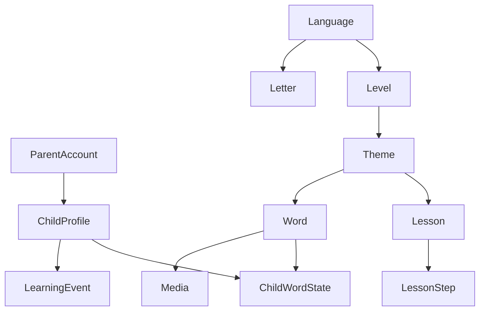

# 📄 SPEC Tahlili

> [!info] Manba
> Ushbu tahlil vault ildizidagi [[SPEC]] (`docs/SPEC.md`) — loyihaning yagona
> haqiqat manbai — asosida tuzilgan.
> Bog'liq: [[01-Loyiha/Maqsad-va-Vizyon|🎯 Maqsad va Vizyon]] · [[01-Loyiha/Funksional-Talablar|✅ FR]] · [[01-Loyiha/Pedagogik-Asos|🧠 Pedagogik asos]]

## 🐻 Mohiyat

**SKAZKA** — 3–7 yoshli o'zbek bolalariga rus tilini o'yin orqali, ilmiy
metodika bilan o'rgatuvchi PWA platforma. Maskot **Mishka**. Differentiator:
**ko'rinmas SRS dvigateli** (so'z kerakli vaqtda o'yin ichida qaytadi).

## 🔗 SPEC bo'limlari → hujjat/modul (Traceability)

| SPEC § | Mavzu | Hujjat / Modul | Holat |
|---|---|---|---|
| §1 | Mahsulot tasavvuri | [[01-Loyiha/Maqsad-va-Vizyon]] | ✅ |
| §2 | Pedagogik asos | [[01-Loyiha/Pedagogik-Asos]] | ✅ |
| §3 | Kontent + kurikulum | [[06-Modullar/Kontent]] | ✅ tahlil |
| §4 | SRS dvigateli | [[02-Arxitektura/SRS-Dvigateli]], [[06-Modullar/SRS-Learning]] | ✅ tahlil |
| §5 | O'yin mexanikalari | [[06-Modullar/Oyin-Mexanikalari]] | ✅ tahlil |
| §6 | Geymifikatsiya | [[06-Modullar/Geymifikatsiya]] | ✅ tahlil |
| §7 | Dizayn tizimi (UX) | [[06-Modullar/Dizayn-Tizimi]] | ✅ tahlil |
| §8 | Foydalanuvchi + xavfsizlik | [[01-Loyiha/Foydalanuvchi-Rollari]], [[02-Arxitektura/Xavfsizlik]] | ✅ |
| §9 | Texnik arxitektura | [[02-Arxitektura/Tizim-Arxitekturasi]], [[02-Arxitektura/Texnologiyalar-Steki]] | ✅ |
| §10 | Ma'lumotlar modeli | [[02-Arxitektura/Malumotlar-Bazasi]] | ✅ tahlil |
| §11 | Yo'l xaritasi (fazalar) | [[03-Reja/Yol-Xaritasi]], [[03-Reja/Bosqichlar]] | ✅ |
| §12 | Faza promtlari | [[03-Reja/Sprintlar]] | ✅ |
| §13 | Tavsiyalar | [[99-Resurslar/Qaror-Jurnali]] | 🟡 |

## 🧭 Asosiy domen obyektlari (SPEC §10)

> To'liq ERD → [[02-Arxitektura/Malumotlar-Bazasi]].

## ❓ Ochiq savollar / qarorlar

> [!question] Aniqlik kiritilishi kerak — [[99-Resurslar/Qaror-Jurnali]]'da kuzatiladi
> 1. **Custom AUTH_USER_MODEL** — Faza 1'da toza DB ustida `ParentAccount` (skeleton'da standart User) → *qaror: Faza 1 boshida migratsiya*.
> 2. **SRS algoritmi** — MVP Leitner, keyin FSRS-lite? → *qaror: interfeys FSRS'ga moslab quriladi*.
> 3. **Audio manbai** — dev TTS vs prod jonli ovoz → *qaror: dev TTS placeholder, prod native*.
> 4. **B2B brending** — `/api/config/` qachon? → *qaror: Faza 11*.
> 5. **`LearningEvent` partitioning** — jadval katta o'sadi → *qaror: keyingi optimizatsiya*.

## ✅ Muvaffaqiyat mezonlari (yuqori daraja)

- [ ] Bola so'zni o'yin orqali o'rganadi va u kengayuvchi intervallarda qaytadi (SRS).
- [ ] Audio-first, matnsiz, ulkan nishonli bolalar UI (PWA, oflayn ishlaydi).
- [ ] Ota-ona panel: rivoj + vaqt cheklovi + hisobot.
- [ ] Kirill treki (tracing + fonetika) to'liq; harflar SRS'ga ulanadi.
- [ ] Ertak (TPRS) + qo'shiq rejimi; ichki-yo'naltirilgan geymifikatsiya.

> [!info] Joriy holat: Faza 0 (skeleton + Docker) ✅; Fazalar 1–11 rejada → [[03-Reja/Bosqichlar]].
