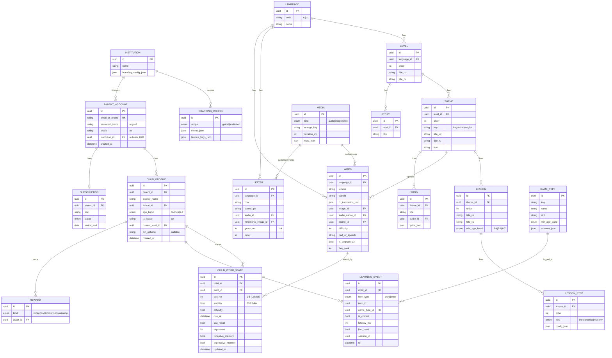
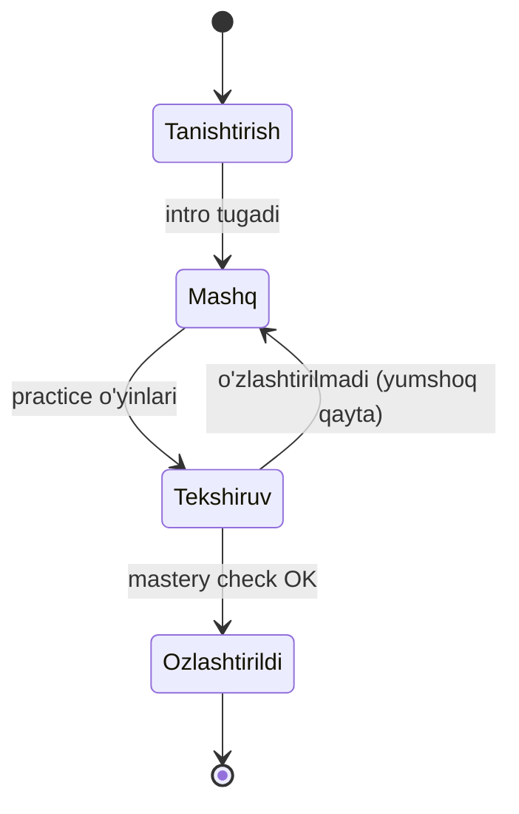

# 🗄️ Ma'lumotlar Bazasi (ERD)

> Bog'liq: [[02-Arxitektura/Tizim-Arxitekturasi]] · [[02-Arxitektura/SRS-Dvigateli]] · [[06-Modullar/Kontent]] · [[06-Modullar/Accounts]]

SPEC §10 dagi asosiy entitilardan kelib chiqqan ma'lumotlar modeli. To'liq DDL emas —
Django modellari shu asosda fazalarda yaratiladi (hozir skeleton **modelsiz**).

## ER diagramma

## Asosiy modellar izohi

- **CHILD_WORD_STATE** — **dvigatel yuragi**: har bola × har so'z uchun xotira holati
  (Leitner `box_no` → keyin FSRS-lite `stability/difficulty`), `due_at`, reseptiv/ekspressiv
  mastery. To'liq mantiq → [[02-Arxitektura/SRS-Dvigateli]].
- **LEARNING_EVENT** — har o'zaro ta'sir yoziladi: ham SRS haydovchi, ham analitika.
  Katta o'sadi → kelajakda partitioning (`ts` bo'yicha).
- **PARENT_ACCOUNT → CHILD_PROFILE** — bitta ota-ona, ko'p bola. Bolaga alohida
  login **YO'Q**, faqat ota-ona sessiyasi ichida (PIN) → [[06-Modullar/Accounts]].
- **INSTITUTION + BRANDING_CONFIG** — `/api/config/` shu yerdan; B2B, bir platforma
  ko'p brending → [[06-Modullar/Billing]].

## Daraja kontent ierarxiyasi (state)

> [!note] Hisoblanadigan / signal bilan yangilanadigan
> - `due_at` — har `LearningEvent`'dan keyin `record_result` qayta hisoblaydi.
> - mastery foizi (ota-ona panel) — `ChildWordState` agregati.
> - semantik interferensiya filtri navbat tuzishda → [[02-Arxitektura/SRS-Dvigateli]].

## Indekslar va qidiruv
- `email_or_phone`, `(child_id, word_id)` → unique.
- `ChildWordState.due_at`, `(child_id, due_at)` → due-so'rovlar uchun indeks.
- `LearningEvent.ts`, `child_id` → analitika + partitioning kaliti.
