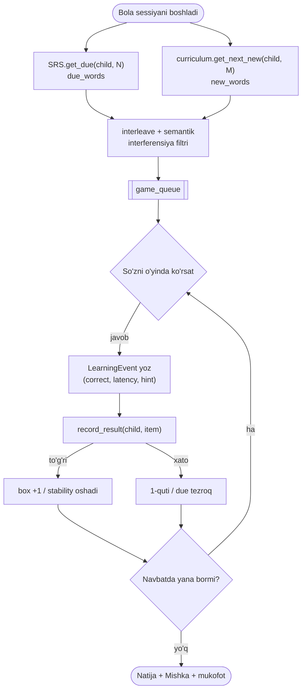

# 🧠 So'z-yodlash Dvigateli (ko'rinmas SRS)

> Bog'liq: [[06-Modullar/SRS-Learning]] · [[01-Loyiha/Pedagogik-Asos]] · [[02-Arxitektura/Malumotlar-Bazasi]] · [[06-Modullar/Oyin-Mexanikalari]]

> [!abstract] Bu nima
> Platformaning **eng muhim va eng murakkab** qismi (SPEC §4). Kattalardagi flashcard
> (Anki) emas — bolaga moslashtirilgan. Har bir o'rganilgan so'z bolaning xotira holatiga
> qarab, kerakli vaqtda, keyingi o'ynaydigan **o'yinining ichida** ko'rinmas qayta paydo
> bo'ladi. Bu alohida "takrorlash" sessiyasi emas — o'yinning bir qismi. Faza 6.

## 🎯 Asosiy g'oya

Har bir **bola × so'z (yoki harf)** uchun xotira holati saqlanadi
(`ChildWordState` / `ChildLetterState`). Bola so'zni o'yin ichida har "uchratganda",
natija (to'g'ri/xato + javob tezligi) yoziladi, so'zning **keyingi takror vaqti**
(`due_at`) qayta hisoblanadi. Muddati kelgan so'z keyingi o'yinga ko'rinmas qo'shiladi.

Ilmiy asos — aktiv eslab qolish (retrieval) + kengayuvchi intervallar
([[01-Loyiha/Pedagogik-Asos]]), bu 4–5 yoshlilarda ham isbotlangan (SPEC §2.5).

## ⚙️ Algoritm (2 bosqich)

### 1-bosqich (MVP) — Leitner qutilari

| Quti | Interval | Quti | Interval |
|:---:|---|:---:|---|
| 1 | 1 kun | 4 | 14 kun |
| 2 | 3 kun | 5 | 30 kun |
| 3 | 7 kun | 6 | o'zlashtirildi (mastered) |

- **To'g'ri javob** → keyingi qutiga ko'tariladi.
- **Xato** → 1-qutiga tushadi (yumshoq, **jazo emas**).
- `due_at <= now` bo'lgan so'zlar keyingi o'yinga **ustuvor** kiritiladi.

### 2-bosqich (keyinroq) — FSRS-lite

Har so'z uchun `stability` (xotira mustahkamligi) + `difficulty` saqlanadi:
`interval = f(stability, difficulty, oxirgi_natija, javob_tezligi)`. FSRS ochiq
algoritmidan ilhomlangan, soddalashtirilgan. MVPdan keyin qo'shiladi.

> [!tip] Interfeysni moslang
> `ChildWordState` `box_no` **va** `stability/difficulty` maydonlarini birga tutadi.
> SRS xizmati interfeysi (`record_result` / `get_due`) o'zgarmaydi → Leitner'dan
> FSRS-lite'ga o'tish backendning ichki ishi bo'lib qoladi.

## 🔄 Reseptiv → Ekspressiv mastery

Har so'z uchun **ikki bosqichli** o'zlashtirish kuzatiladi:

| Tur | Mexanika | Maqsad | Yosh |
|---|---|---|---|
| **Reseptiv** (tanish) | "Qaysi rasm — кошка?" (eshit → top) | Birinchi maqsad | 3+ |
| **Ekspressiv** (ishlab chiqarish) | Bola so'zni o'zi aytadi (ASR) | Keyingi faza | 5+ |

> 3–4 yosh: **faqat reseptiv**. 5+ yosh: reseptiv mustahkam bo'lgach, ekspressiv boshlanadi.

## 🎮 Retrievalni o'yinga "to'qish" (weaving) — kalit mexanika

```
Bola darsni/o'yinni boshlaganda:
  due_words = SRS.get_due(child, limit=N)         # muddati kelgan so'zlar
  new_words = curriculum.get_next_new(child, M)   # yangi so'zlar
  game_queue = interleave(due_words, new_words)   # aralashtirish
                # semantik interferensiyani oldini olib
                # (o'xshash so'zlar: mishka/mushka — yonma-yon EMAS)
  → har so'z mos keladigan o'yin mexanikasida ko'rsatiladi
  → har javob → LearningEvent yoziladi → SRS yangilanadi
```

Bola "takrorlash" so'zini hech qachon ko'rmaydi — bu shunchaki keyingi o'yin.

## 🧾 LearningEvent — har o'zaro ta'sirdan yoziladi

`child_id · item_type (word/letter) · item_id · game_type · is_correct · latency_ms ·
hint_used · session_id · timestamp`

Bu ham SRSni boshqaradi, ham analitika beradi → [[06-Modullar/SRS-Learning]].

## 🛣️ Sessiya navbati oqimi



## 📥 API (Faza 6)

| Method | Endpoint | Tavsif |
|---|---|---|
| GET | `/api/v1/learning/session/` | o'yin navbati (`interleave(due, yangi)`) |
| POST | `/api/v1/learning/event/` | natija yozish → SRS yangilanadi |

Oflayn bo'lsa `LearningEvent` outbox'ga yoziladi, ulanish tiklanganda idempotent
sync bo'ladi → [[02-Arxitektura/API-Dizayni]].

> [!warning] Semantik interferensiya
> Bir-biriga o'xshash so'zlarni (mishka/mushka) bir vaqtda yoki yonma-yon o'rgatmaslik
> kerak (SPEC §2.5). `interleave` navbat tuzishda buni hisobga oladi.

> [!success] Qabul mezoni (Faza 6)
> Bola so'zni o'rgansa — keyingi sessiyalarda kengayuvchi intervallarda qaytadi; xato
> so'z tezroq qaytadi; barcha javoblar `LearningEvent`'ga yoziladi; navbat due+yangi'ni
> aralashtiradi. To'liq spetsifikatsiya: [[SPEC]] §4.
