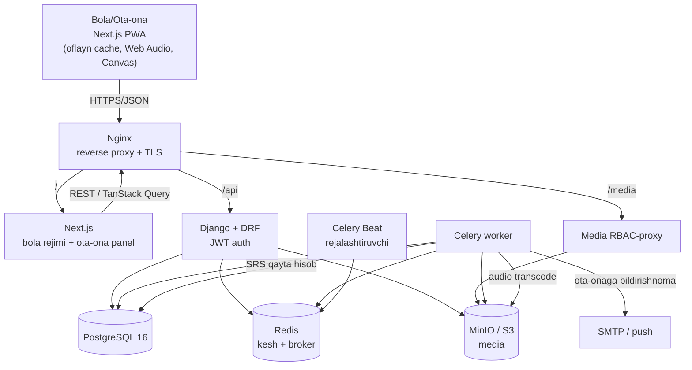

# 🏛️ Tizim Arxitekturasi

> Bog'liq: [[02-Arxitektura/Texnologiyalar-Steki]] · [[02-Arxitektura/Malumotlar-Bazasi]] · [[02-Arxitektura/SRS-Dvigateli]] · [[05-DevOps/Docker-Setup]]

SPEC §9.1 dagi yuqori darajadagi ko'rinishdan kelib chiqqan komponent sxemasi.
Hammasi **Docker Compose** ostida ko'tariladi (Faza 0 bajarilgan).

## Yuqori darajadagi sxema

## Komponentlar

### Nginx (reverse proxy)
- TLS terminatsiya (HTTPS majburiy).
- `/` → Next.js, `/api/` va `/admin/` → Django.
- `/media/` → RBAC-proxy: media faqat ruxsatli bola/ota-ona uchun → [[02-Arxitektura/Xavfsizlik]].
- Static/media keshlash, gzip, rate-limiting. Batafsil: [[05-DevOps/Nginx-Konfiguratsiya]].

### Next.js (frontend) — audio-birinchi PWA
- App Router, bola rejimi (matnsiz, ulkan nishon) + ota-ona panel.
- Service Worker: joriy birlik darslari + media oflayn keshlanadi.
- Oflayn `LearningEvent`'lar **outbox**'ga yoziladi → onlayn bo'lganda sync.
- Navigatsiya Mishka/ikona orqali → [[06-Modullar/Dizayn-Tizimi]].

### Django + DRF (backend)
- Modul-asosli `apps/` (har bir bounded-context alohida): `common`, `accounts`,
  `content`, `learning`, `gamification`, `media`, `billing`.
- DRF ViewSet + Serializer + Permission (RBAC: ota-ona / child-context).
- Django Admin — kontent boshqaruvi (kurikulum, harf, so'z, media, ertak).

### Celery + Redis (fon vazifalar)
- **worker** — audio normalize/transcode (mp3/ogg), rasm resize, ota-onaga bildirishnoma.
- **beat** — kunlik agregat, SRS ommaviy qayta hisob → [[02-Arxitektura/SRS-Dvigateli]].
- Redis ham kesh (kontent kamdan-kam o'zgaradi → ETag + cache).

### PostgreSQL
- Asosiy baza. `LearningEvent` katta o'sadi → kelajakda partitioning.

### MinIO / S3
- Media (audio/rasm/lottie). Dev=MinIO, prod=S3+CDN → [[06-Modullar/Media]].

## Ma'lumot oqimi misoli — "Bola so'zni o'yinda topdi"
1. Bola "Eshit va bos"da to'g'ri rasmni bosadi.
2. Next.js → `POST /api/v1/learning/event/` (yoki oflayn → outbox).
3. DRF child-context tekshiradi; `LearningEvent` yoziladi.
4. SRS xizmati `record_result` → `ChildWordState` box/due_at yangilanadi.
5. Keyingi sessiya navbati `due + yangi` aralashtirib qaytadi.
6. Mishka quvonadi, konfetti — darhol ijobiy feedback.

## Muhitlar (Environments)
- **dev** — `docker-compose.yml`, hot-reload, MinIO.
- **prod** — optimallashtirilgan image'lar, Nginx + TLS, S3+CDN.
- Batafsil: [[05-DevOps/Deploy]].
