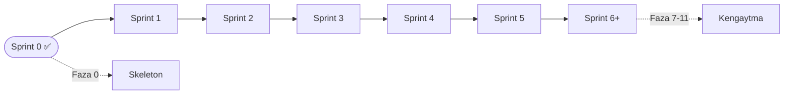

# 🏃 Sprintlar

> [!abstract] Bog'liq
> [[03-Reja/Bosqichlar|🪜 Bosqichlar]] · [[03-Reja/Yol-Xaritasi|🛣️ Yo'l Xaritasi]] · [[04-Vazifalar/Backlog|📥 Backlog]] · [[SPEC]]

Har sprint ~2 hafta (SRS yadrosi uchun ~3 hafta). Vazifalar [[04-Vazifalar/Backlog|📥 Backlog]]'dan olinadi va [[04-Vazifalar/Jarayonda|🔄 Jarayonda]] → [[04-Vazifalar/Bajarilgan|✅ Bajarilgan]] bo'ylab harakatlanadi. Sprintlar SPEC §11 fazalariga mos keladi.

## ✅ Sprint 0 — Skeleton (Faza 0, TUGADI)
- Monorepo, Docker Compose (db, redis, minio, backend, worker, beat, frontend, nginx, backup), env, Makefile.
- Django apps skeleti + Next.js+PWA Nginx orqali.
- **Deliverable:** ishlaydigan skelet (biznes-logikasiz) → [[03-Reja/Bosqichlar#Faza 0]].
- **Demo mezoni:** ✅ `docker compose up` → `/api/health/` 200, frontend ochiladi, migratsiyalar o'tadi, worker ulanadi.

## 🟡 Sprint 1 — Auth & profillar (Faza 1)
- Custom `AUTH_USER_MODEL` + `ParentAccount`, JWT (register/login/refresh/me).
- `ChildProfile` CRUD + "profilga o'tish" child-context token; frontend profil tanlash + Parent Gate.
- **Deliverable:** ota-ona auth + bola profillari → [[06-Modullar/Accounts]].
- **Demo mezoni:** ota-ona ro'yxatdan o'tadi, 2+ profil yaratadi, profilga o'tadi; Parent Gate'siz sozlamaga kirib bo'lmaydi.

## Sprint 2 — Kontent & Admin (Faza 2)
- content modellari (Language…Song, Media) + Django Admin inline'lar.
- `seed_content`: ru/Level 1, 1-harf guruhi, 2 mavzu, GameType katalogi (11 mexanika).
- **Deliverable:** tahrirlanadigan kontent + demo darslar → [[06-Modullar/Kontent]].
- **Demo mezoni:** admin'da so'z/harf/dars kiritiladi; `seed_content` demo darslarni yaratadi; GameType katalogi to'la.

## Sprint 3 — Media & kontent API (Faza 3)
- MinIO yuklash + `Media`; Celery audio normalize/transcode, rasm resize.
- `GET /api/curriculum/`, `GET /api/lesson/{id}/` (media URL'lari + GameType konfiglari); Redis kesh + ETag.
- **Deliverable:** frontend o'qiy oladigan kontent API → [[02-Arxitektura/API-Dizayni]], [[06-Modullar/Media]].
- **Demo mezoni:** frontend `/api/curriculum` va `/api/lesson` orqali media URL'lari bilan to'liq kontent oladi.

## Sprint 4 — Dizayn & bolalar qobig'i (Faza 4)
- Dizayn tokenlari + komponentlar (ulkan tugma, Mishka maskot), `useAudio` hook.
- Uy ekrani + sayohat xaritasi, Framer Motion, PWA o'rnatish.
- **Deliverable:** ovozli/animatsiyali bolabop qobiq → [[06-Modullar/Dizayn-Tizimi]].
- **Demo mezoni:** bola xaritada yuradi, mavzu tanlaydi, har teginish ovoz+animatsiya; PWA o'rnatiladi.

## Sprint 5 — O'yin dvigateli + 3 mexanika (Faza 5)
- Data-driven "GamePlayer" + dars oqimi (intro→practice→mastery→natija).
- Eshit va bos, Juftla, Topib ber; to'g'ri/xato feedback (jazo yo'q).
- **Deliverable:** boshidan oxiriga o'ynaladigan dars → [[06-Modullar/Oyin-Mexanikalari]].
- **Demo mezoni:** bola 3 mexanikali darsni o'ynaydi, feedback ishlaydi, natija ekrani chiqadi.

## Sprint 6 — SRS dvigateli (Faza 6, ~3 hafta) 🧠
- `ChildWordState`/`ChildLetterState`, `LearningEvent`, SRS xizmati (record/get_due/get_session_queue).
- `POST /api/learning/event/`, `GET /api/learning/session/`; frontend outbox/sync.
- **Deliverable:** ko'rinmas takrorlash ishlaydi → [[02-Arxitektura/SRS-Dvigateli]], [[06-Modullar/SRS-Learning]].
- **Demo mezoni:** o'rganilgan so'z kengayuvchi intervallarda qaytadi; xato so'z tezroq; navbat due+yangi aralashtiradi.

## Sprint 7+ — Kengaytma (Faza 7–11)
Kirill treki, geymifikatsiya + ota-ona paneli, ertak (TPRS) + qo'shiqlar, offline/PWA + sync + analitika, va kelajak (ASR / AI-tutor / B2B).
→ [[03-Reja/Bosqichlar#Faza 7]] · [[03-Reja/Bosqichlar#Faza 11]]

> [!success] Sprint shabloni (har sprint oxirida)
> - [ ] ✅ Demo bajarildimi (faza "Tugadi mezoni")?
> - [ ] 🧪 Testlar yashilmi (CI) → [[05-DevOps/CI-CD]]?
> - [ ] 📝 [[04-Vazifalar/Bajarilgan|✅ Bajarilgan]]'ga ko'chirildimi?
> - [ ] 🔁 Retrospektiva: nima yaxshi bo'ldi / nimani yaxshilash kerak?
> - [ ] 📖 [[SPEC]]'ga muvofiqlik tekshirildimi (chetga chiqqan joylar)?
