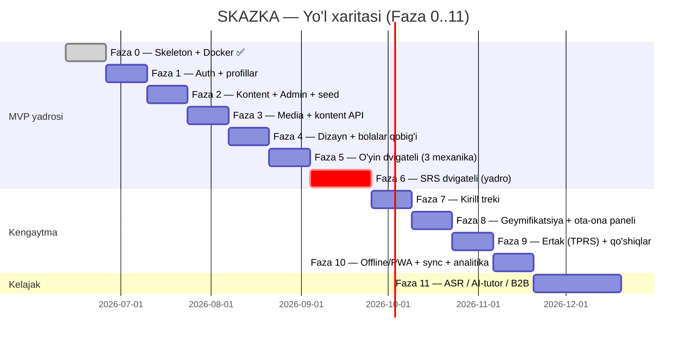

# 🛣️ Yo'l Xaritasi (Roadmap)

> [!abstract] Bog'liq
> [[03-Reja/Bosqichlar|🪜 Bosqichlar]] · [[03-Reja/Sprintlar|🏃 Sprintlar]] · [[04-Vazifalar/Backlog|📥 Backlog]] · [[SPEC]]

## 🎯 Umumiy yondashuv
SKAZKA **iterativ (Agile)** usulda, fazalarga bo'lib quriladi (SPEC §11). Avval **MVP yadrosi** (Faza 0–6) — bu allaqachon so'z o'rgatadigan ishlaydigan mahsulot; keyin kirill, geymifikatsiya, kontekstli o'rganish va sayqal (Faza 7–10); oxirida kelajak kengaytmalari (Faza 11).

## 🪜 Fazalar (qisqacha)

### ✅ Faza 0 — Skeleton va Docker (TUGADI)
Monorepo, Docker Compose (db, redis, minio, backend, worker, beat, frontend, nginx, backup), Django apps skeleti, Next.js+PWA, `/api/health/` 200.
→ [[03-Reja/Bosqichlar#Faza 0]]

### 🟡 Faza 1–6 — MVP yadrosi
Auth + profillar, kontent modeli + Admin + seed, media pipeline + kontent API, dizayn tizimi + bolalar qobig'i, o'yin dvigateli (3 mexanika), va **ko'rinmas SRS dvigateli** (loyiha yuragi).
→ [[03-Reja/Bosqichlar#Faza 1]] · [[02-Arxitektura/SRS-Dvigateli|🧠 SRS dvigateli]]

### 🔵 Faza 7–10 — Kengaytma
Kirill treki (tracing, fonetika), geymifikatsiya + ota-ona paneli, ertak (TPRS) + qo'shiqlar, offline/PWA + sync + analitika.
→ [[03-Reja/Bosqichlar#Faza 7]]

### 🟣 Faza 11 — Kelajak
Ovoz tanish (ASR), AI-tutor (Claude API), B2B brending paneli, ko'p o'yinchi, adaptiv qiyinlik.
→ [[03-Reja/Bosqichlar#Faza 11]]

## 🧾 Prioritet (MoSCoW)

| Daraja | Tarkib |
|---|---|
| **Must** | Skeleton/Docker, Auth + profillar, Kontent modeli, Media + API, Bolalar qobig'i, 3 o'yin mexanikasi, **SRS dvigateli** |
| **Should** | Kirill treki, Geymifikatsiya, Ota-ona paneli, Offline/PWA + sync |
| **Could** | Ertak (TPRS), Qo'shiqlar, Analitika dashboard |
| **Won't (hozircha)** | ASR, AI-tutor, B2B brending, ko'p o'yinchi (→ Faza 11) |

> [!tip] MVP avval
> Faza 0–6 tugagach bola so'zlarni o'yin orqali o'rganadi va ko'rinmas takrorlash ishlaydi — qolgan hammasi shu yadroning ustiga quriladi.
