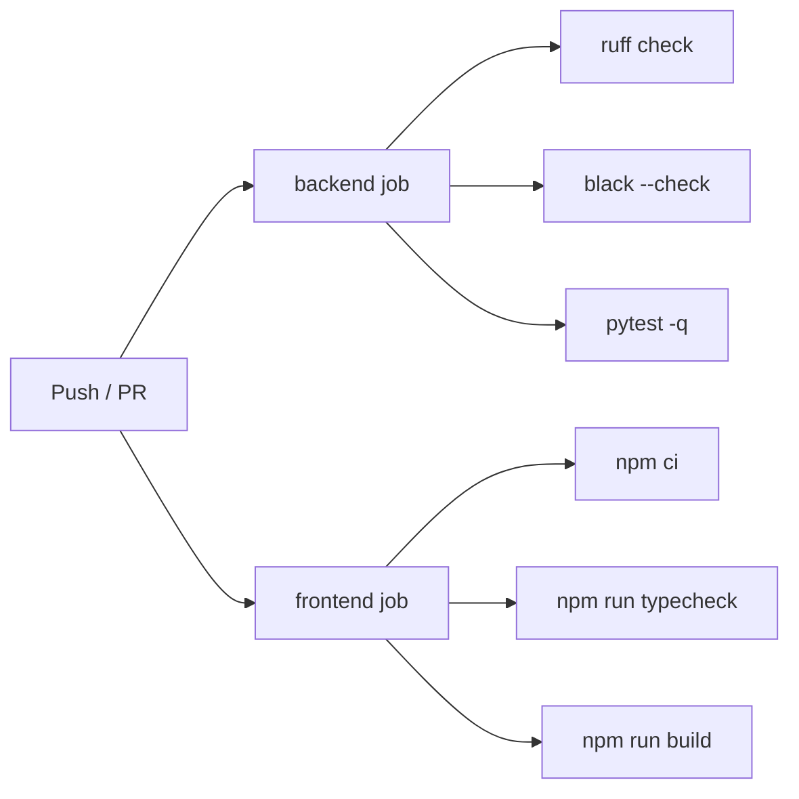

# ♻️ CI/CD

> [!abstract] Bog'liq: [[05-DevOps/Docker-Setup|🐳 Docker sozlamasi]] · [[05-DevOps/Deploy|🚀 Deploy]] · [[01-Loyiha/Nofunksional-Talablar|🧾 Nofunksional talablar]] · [[03-Reja/Bosqichlar#Faza 0]]

Ikki GitHub Actions workflow: `ci.yml` (har push/PR'da sifat tekshiruvi) va `deploy.yml` (faqat `main`'da — GHCR image + SSH deploy).

## 🔄 `ci.yml` — sifat darvozasi

`on: pull_request` va `push: main`. Ikki mustaqil job parallel ishlaydi.

| Job | Setup | Bosqichlar |
|---|---|---|
| `backend` | `setup-python@v5` (3.12, pip cache) | `ruff check .` · `black --check .` · `pytest -q` |
| `frontend` | `setup-node@v4` (20, npm cache) | `npm ci` · `npm run typecheck` · `npm run build` |

> [!info] Faza 0 nuanslari
> Modellar hali yo'q, shuning uchun `pytest` `|| true` bilan ishlaydi (testlar qo'shilgach olib tashlanadi). Frontend `build` bosqichida `NODE_OPTIONS=--max-old-space-size=4096` Dockerfile'da o'rnatilgan — CI runner xotirasi cheklangani uchun OOM-kill o'rniga GC qildiriladi.

## 🚀 `deploy.yml` — build + deploy

`on: push: main` + `workflow_dispatch`. `concurrency` bilan eski deploy bekor qilinadi (`cancel-in-progress`).

### 1) `build` job (GHCR'ga push)

- `permissions: packages: write`; `docker/login-action` `${{ secrets.GITHUB_TOKEN }}` bilan GHCR'ga kiradi.
- Image nomlari **lowercase** qilinadi; teg = `latest` + `${GITHUB_SHA::7}`.
- `build-push-action@v6` GHA keshi (`cache-from/to: type=gha`) bilan backend va frontend (target `prod`) image'larini build qilib `ghcr.io/<owner>/skazka-backend|frontend` ga yuklaydi.
- Frontend build-arg: `NEXT_PUBLIC_API_URL=/api/v1` (bundle ichiga yoziladi).

### 2) `deploy` job (SSH)

- `needs: build`, `environment: production`.
- `scp-action` → serverga `docker-compose.deploy.yml`, `nginx/prod-http.conf`, `nginx/proxy_params` ko'chiriladi.
- `ssh-action` (timeout 25m): GHCR login → `pull` → **`run --rm release`** (migrate + idempotent seed, `release` profili) → `up -d --remove-orphans` → `restart nginx beat` → `image prune -f`.

> [!warning] Tartib muhim
> `release` ilova konteynerlari ko'tarilishidan **oldin** bir marta ishlaydi. `set -e` tufayli migratsiya yiqilsa deploy shu yerda to'xtaydi — yarim deploy bo'lmaydi. Tafsilot → [[05-DevOps/Deploy|🚀 Deploy]].

Kerakli secret'lar va `release.sh` mantiqi → [[05-DevOps/Deploy#GitHub Secrets|Deploy → Secrets]].
