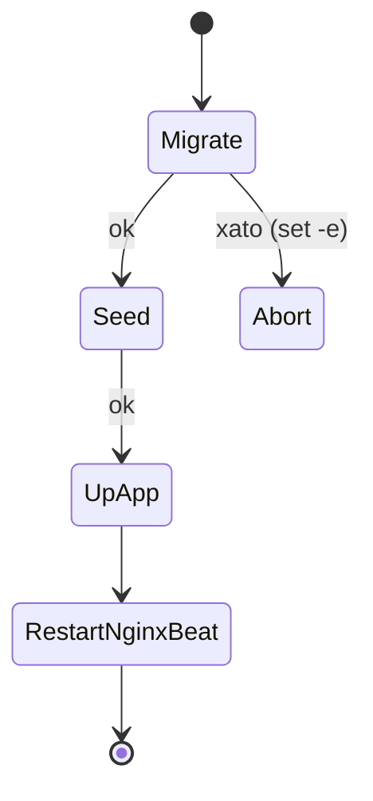

# 🚀 Deploy va Backup

> [!abstract] Bog'liq: [[05-DevOps/Docker-Setup|🐳 Docker sozlamasi]] · [[05-DevOps/Nginx-Konfiguratsiya|🌐 Nginx]] · [[05-DevOps/CI-CD|♻️ CI/CD]] · [[01-Loyiha/Nofunksional-Talablar|🧾 NFR — backup]]

Serverda **build qilinmaydi**: CI tayyor image'larni GHCR'ga yuklaydi, server faqat `pull` qiladi. Asosiy fayl — `docker-compose.deploy.yml`.

## 🐳 `docker-compose.deploy.yml`

- Barcha ilova servislari `${BACKEND_IMAGE}` / `${FRONTEND_IMAGE}` (default `ghcr.io/OWNER/skazka-*:latest`) image'laridan.
- `DJANGO_SETTINGS_MODULE=config.settings.prod`, `DJANGO_DEBUG=False`, har servisda `restart: unless-stopped`.
- nginx **8090**→80 (host 80/443 edge tomonidan band) + `nginx/prod-http.conf`.
- Volume'lar **external** — `docker compose down -v` ham o'chira olmaydi:

```bash
docker volume create skazka_pgdata skazka_miniodata skazka_redisdata skazka_staticfiles
```

| Volume | external name |
|---|---|
| pgdata | `skazka_pgdata` |
| miniodata | `skazka_miniodata` |
| redisdata | `skazka_redisdata` |
| staticfiles | `skazka_staticfiles` |

## 🔄 `release` bosqichi (`release.sh`)

`release` servisi `profiles: [release]` ostida — `up -d` bilan avtomatik ko'tarilmaydi; CI uni alohida chaqiradi:

```bash
docker compose -f docker-compose.deploy.yml run --rm release
```

`release.sh` mantiqi (`set -eu`):
1. `python manage.py migrate --noinput` — **strogo**, yiqilsa deploy to'xtaydi.
2. Idempotent seed/setup: `init_storage`, `seed_demo` — `has_cmd` bilan image'da bor-yo'qligi tekshiriladi, yo'q bo'lsa sakrab o'tiladi (yangi app qo'shilsa ro'yxatga qo'shiladi).



## 💾 Backup strategiyasi (NFR — avtomatik zaxira)

> [!warning] SPEC talabi: avtomatik zaxira
> `backup` servisi — alohida `postgres:16-alpine` konteyner, ichida cheksiz halqa:

```sh
pg_dump -h db -U "$POSTGRES_USER" "$POSTGRES_DB" | gzip > /backups/db-$ts.sql.gz
ls -t /backups/*.sql.gz | tail -n +8 | xargs -r rm -f   # oxirgi 7 nusxa
sleep 86400                                              # 24 soat
```

Dump'lar `./backups` (host) ga yoziladi, eng yangi **7 nusxa** saqlanadi. Media → MinIO versiyalash + `mc mirror` (keyingi fazada). Tiklash testi oyiga bir marta.

## 🔐 GitHub Secrets

| Secret | Vazifa |
|---|---|
| `SSH_HOST` / `SSH_USER` / `SSH_KEY` | Serverga SSH/SCP kirish |
| `SSH_PORT` | SSH port (default 22) |
| `DEPLOY_PATH` | Serverdagi compose papkasi |
| `GHCR_TOKEN` | Serverda GHCR'dan `pull` uchun token |
| `GITHUB_TOKEN` | CI build'da GHCR'ga `push` (avto beriladi) |

## ♻️ Rollback

Image'lar SHA bilan teglangan (`:<sha7>`). Muammo bo'lsa serverda `BACKEND_IMAGE`/`FRONTEND_IMAGE` ni oldingi SHA tegga o'rnatib `pull` + `up -d`; kerak bo'lsa migratsiyani teskari qaytarish. To'liq oqim → [[05-DevOps/CI-CD|♻️ CI/CD]].
