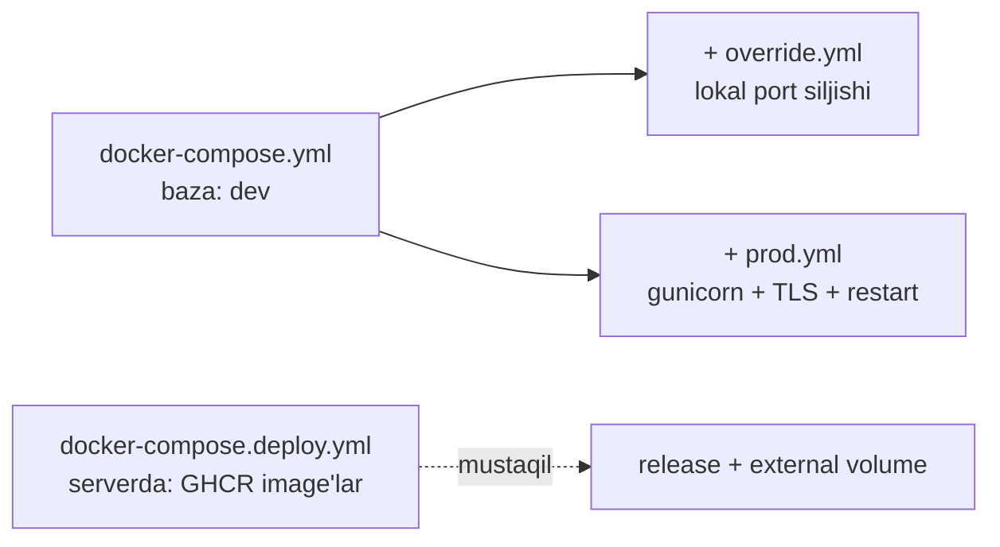

# 🐳 Docker sozlamasi

> [!abstract] Bog'liq: [[05-DevOps/Nginx-Konfiguratsiya|🌐 Nginx]] · [[05-DevOps/Deploy|🚀 Deploy]] · [[02-Arxitektura/Tizim-Arxitekturasi|🏛️ Tizim arxitekturasi]] · [[SPEC#9.4. Docker]]

Butun SKAZKA stack'i Docker Compose orqali ko'tariladi. **Faza 0** tugadi: `docker compose up -d --build` bilan hamma servis ishga tushadi, `/api/health/` 200 qaytaradi.

## ⚙️ Servislar

| Servis | Image / Build | Vazifa | Port (host) |
|---|---|---|---|
| `db` | `postgres:16-alpine` | Ma'lumotlar bazasi | **5433**→5432 |
| `redis` | `redis:7-alpine` | Kesh + Celery broker | — (internal) |
| `minio` | `minio/minio` | Media saqlash (S3-mos) | **9000** API / **9001** konsol |
| `backend` | `docker/backend.Dockerfile` | Django + DRF (dev: runserver) | — (expose 8000) |
| `worker` | backend image | `celery -A config worker` | — |
| `beat` | backend image | `celery -A config beat` (DB scheduler) | — |
| `frontend` | `docker/frontend.Dockerfile` (target `dev`) | Next.js + PWA (hot reload) | — (expose 3000) |
| `nginx` | `nginx:1.27-alpine` | Reverse proxy + static | **8080**→80 |
| `backup` | `postgres:16-alpine` | Kunlik `pg_dump`, 7 nusxa | — |

> [!info] Nostandart portlar
> `db` → **5433** va `nginx` → **8080** lokal Postgres (5432) va 80-port bilan to'qnashmaslik uchun maxsus tanlangan. `docker-compose.override.yml` `db` ni yana ham **5434** ga ko'chiradi (ikkilamchi muhit uchun).

## 🧱 Named volume'lar va healthcheck'lar

| Volume | Servis | Maqsad |
|---|---|---|
| `pgdata` | db | Postgres ma'lumotlari |
| `redisdata` | redis | Redis AOF/RDB |
| `miniodata` | minio | Media obyektlar |
| `staticfiles` | backend ↔ nginx | `collectstatic` chiqishi (nginx `:ro` o'qiydi) |
| `frontend_node_modules` | frontend | recreate'da `node_modules` saqlanadi (anonim emas) |

Healthcheck'lar: `db` → `pg_isready`, `redis` → `redis-cli ping`, `minio` → `mc ready local`. `backend` ularni `depends_on: condition: service_healthy` orqali kutadi.

## ♻️ 4-qatlamli compose strategiyasi



| Fayl | Qachon | Nima qiladi |
|---|---|---|
| `docker-compose.yml` | dev (default) | runserver, `next dev`, bind-mount kod |
| `docker-compose.override.yml` | dev (avto) | `db` portini 5434 ga `!override` |
| `docker-compose.prod.yml` | bir serverda build | gunicorn, `next start`, `collectstatic`, TLS, `restart: unless-stopped` |
| `docker-compose.deploy.yml` | CI deploy (GHCR) | tayyor image'lar, `release` profili, `external` volume'lar → [[05-DevOps/Deploy\|🚀 Deploy]] |

## 🚀 Quick-start (Makefile orqali)

> [!tip] Asosiy buyruqlar
> ```bash
> docker compose up -d --build      # yoki: make up
> make migrate                      # migratsiyalarni qo'llash
> make superuser                    # admin yaratish
> make logs                         # backend loglari
> ```
> `make help` — barcha buyruqlar ro'yxati (lint, fmt, test, seed, shell).

Backend dev `command`'i o'zi `migrate` + `init_storage` + `runserver` ni ketma-ket bajaradi, shuning uchun birinchi `up` dan keyin DB tayyor bo'ladi. Prod farqi va CI deploy → [[05-DevOps/CI-CD|♻️ CI/CD]].
