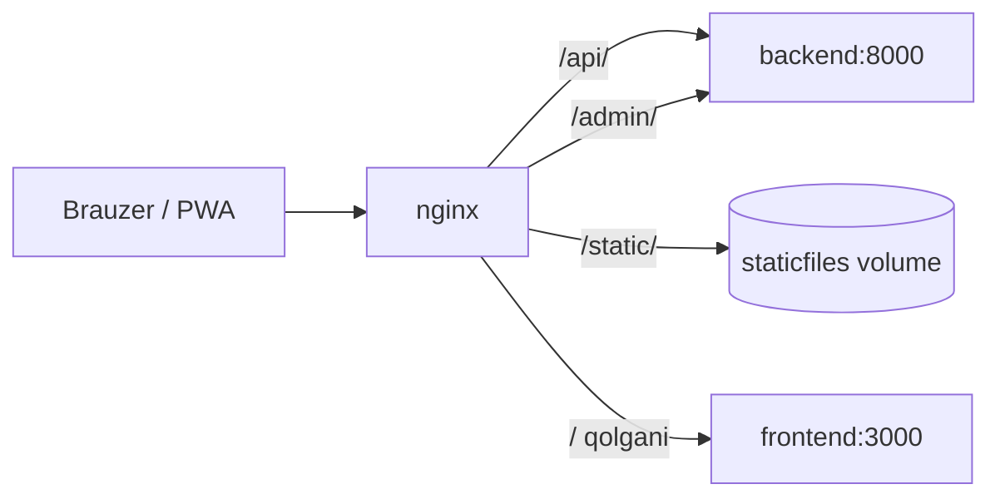

# 🌐 Nginx konfiguratsiya

> [!abstract] Bog'liq: [[05-DevOps/Docker-Setup|🐳 Docker sozlamasi]] · [[05-DevOps/Deploy|🚀 Deploy]] · [[02-Arxitektura/Xavfsizlik|🔐 Xavfsizlik]] · [[06-Modullar/Media|🎨 Media]]

Nginx — yagona kirish nuqtasi (reverse proxy): marshrutlash, static keshlash, media uchun katta `client_max_body_size`, prod'da TLS + rate-limit.

## 🛣️ Marshrutlash mantiqi (hammasi uchun bir xil)



- `/api/` → `backend:8000` (DRF)
- `/admin/` → `backend:8000` (Django admin)
- `/static/` → `staticfiles` volume'idan `alias` bilan (backend'ga tegmaydi)
- `/` → `frontend:3000` (Next.js; dev'da HMR websocket ham shu yerdan)

> [!info] Bola uchun media
> Audio/rasm yirik bo'lishi mumkin, shuning uchun barcha konfiglarda `client_max_body_size 50m`. `proxy_params` `Upgrade`/`Connection` headerlarini uzatadi (websocket + HMR).

## 🧾 Uch xil konfig

| Fayl | Muhit | Tafsilot |
|---|---|---|
| `nginx/dev.conf` | dev (compose default) | HTTP, 80→host 8080, soddalashtirilgan |
| `nginx/prod.conf` | bir serverda TLS | HTTPS 443 + http2, Let's Encrypt, HSTS, rate-limit, gzip |
| `nginx/prod-http.conf` | edge ortida | faqat HTTP; TLS'ni Caddy/Traefik/CDN terminate qiladi |

Barchasi umumiy `nginx/proxy_params` ni `include` qiladi (Host, X-Real-IP, X-Forwarded-*, websocket Upgrade, `proxy_read_timeout 120s`).

## 🔐 `prod.conf` — production qo'shimchalari

- **TLS**: `listen 443 ssl; http2 on;`, Let's Encrypt sertifikat; 80 → 443 redirect; `/.well-known/acme-challenge/` certbot uchun ochiq.
- **Xavfsizlik headerlari**: HSTS, X-Frame-Options, X-Content-Type-Options, Referrer-Policy → [[02-Arxitektura/Xavfsizlik|🔐 Xavfsizlik]].
- **Rate-limit**: ikki zona —

```nginx
limit_req_zone $binary_remote_addr zone=login:10m rate=5r/m;
limit_req_zone $binary_remote_addr zone=api:10m   rate=30r/s;

location /api/v1/auth/login { limit_req zone=login burst=5  nodelay; proxy_pass http://backend; }
location /api/              { limit_req zone=api   burst=20 nodelay; proxy_pass http://backend; }
```

- **Gzip** matn javoblar uchun; static `expires 30d`.

## 🌍 `prod-http.conf` — edge ortida

Tashqi edge (CDN/Caddy/Traefik) TLS'ni terminate qilganda ishlatiladi. Diqqat qiladigan jihatlar:

- `resolver 127.0.0.11 valid=10s;` + `set $upstream ...` — konteyner IP o'zgarsa eskirgan IP keshlanmasin.
- `map $http_x_forwarded_proto $client_proto` — edge bergan sxemani ishonib uzatadi.
- Host 80/443 edge tomonidan band bo'lishi mumkin → compose'da SKAZKA nginx **8090**-portda turadi. Deploy aynan shu konfigni ishlatadi → [[05-DevOps/Deploy|🚀 Deploy]].

> [!tip] TLS yangilash
> `certbot renew` (cron) sertifikatni yangilaydi, keyin `docker compose restart nginx`. Edge ortida ishlatilsa TLS umuman SKAZKA nginx'da bo'lmaydi.
