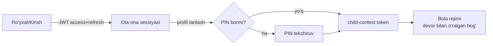

# 🔐 Accounts moduli

> Faza 1 · Bog'liq: [[01-Loyiha/Foydalanuvchi-Rollari]] · [[02-Arxitektura/Xavfsizlik]] · [[06-Modullar/Dizayn-Tizimi#Parent Gate]] · [[SPEC]]

SPEC §8 bo'yicha autentifikatsiya yadrosi: **bitta ota-ona akkaunti → bir nechta bola profili**. Bolaga alohida login/email YO'Q — u faqat ota-ona sessiyasi ichida yashaydi.

> [!warning] Skeleton holati (Faza 0)
> Hozir `accounts` app **modelsiz skeleton** va Django standart `User`'i ishlatiladi.
> Faza 1'da **toza DB ustida** custom `AUTH_USER_MODEL = accounts.ParentAccount`
> joriy etiladi. Bu yagona "katta" migratsiya — Faza 0 demosida hech qanday foydalanuvchi
> ma'lumoti saqlanmagani uchun migratsiya muammosiz amalga oshadi.

## Modellar (SPEC §10)

| Model | Asosiy maydonlar | Izoh |
|---|---|---|
| `ParentAccount` | `email`/`phone`, `password_hash`, `locale`, `created_at` | `AUTH_USER_MODEL`; JWT egasi |
| `ChildProfile` | `parent`→FK, `display_name`, `avatar_id`, `age_band`, `l1_locale='uz'`, `current_level`→FK, `pin` (ixtiyoriy) | Bola minimal ma'lumot |

> [!info] Yosh-diapazon (age_band)
> `3-4` va `5-7` — bu pedagogik tabaqalanish kaliti (SPEC §2.8): UI murakkabligi,
> tanlovlar soni, ekspressiv rejim shu maydonga qarab ochiladi.

## Auth oqimi

- JWT (SimpleJWT): `register`, `login`, `refresh`, `me`.
- **Profilga o'tish:** alohida login emas — ota-ona JWT ichida child-context token chiqariladi.
- **Parent Gate:** sozlama/xaridga kirishdan oldin kattalar tekshiruvi → [[06-Modullar/Dizayn-Tizimi#Parent Gate]].
- Bola rejimi: chat/reklama/tashqi havola/ijtimoiy funksiya YO'Q.

## API (DRF, `/api/v1/`)
- `POST /auth/register`, `POST /auth/login`, `POST /auth/refresh`, `GET /auth/me`
- `GET/POST/PATCH/DELETE /children/` — profil CRUD (faqat egasi)
- `POST /children/{id}/enter/` — child-context token (PIN bilan, agar bor)

## Ruxsatlar
- Ota-ona faqat o'z bola profillarini ko'radi/tahrir qiladi → [[02-Arxitektura/Xavfsizlik#Ruxsatlar matritsasi]].
- Child-context token faqat o'qish + `learning/event` yozishga ruxsat beradi.

## Acceptance
- [ ] Custom `AUTH_USER_MODEL` toza DB'da joriy etildi (migratsiya o'tadi).
- [ ] Ota-ona ro'yxatdan o'tadi/kiradi, JWT oladi.
- [ ] 2+ bola profili yaratiladi va profillar orasida almashish ishlaydi.
- [ ] Parent Gate'siz sozlamaga kirib bo'lmaydi.
- [ ] Bolaga alohida login mavjud emas (faqat child-context).
