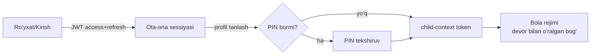

# 🔐 Accounts moduli

> Faza 1 · Bog'liq: [[01-Loyiha/Foydalanuvchi-Rollari]] · [[02-Arxitektura/Xavfsizlik]] · [[06-Modullar/Dizayn-Tizimi#Parent Gate]] · [[SPEC]]

SPEC §8 bo'yicha autentifikatsiya yadrosi: **bitta ota-ona akkaunti → bir nechta bola profili**. Bolaga alohida login/email YO'Q — u faqat ota-ona sessiyasi ichida yashaydi.

> [!success] Bajarildi (Faza 1 — 2026-06-27)
> Custom `AUTH_USER_MODEL = accounts.ParentAccount` **toza DB ustida** joriy etildi
> (`accounts.0001_initial` + `token_blacklist` migratsiyalari o'tdi). Backend 16 pytest,
> frontend 2 Playwright (happy path), adversarial security review o'tdi. Tafsilot:
> [[04-Vazifalar/Bajarilgan#✅ Faza 1 — Auth + ota-ona akkaunti + bola profillari (2026-06-27)|Bajarilgan]].

## Modellar (SPEC §10)

| Model | Asosiy maydonlar | Izoh |
|---|---|---|
| `ParentAccount` | `email`/`phone`, `password_hash`, `locale`, `created_at` | `AUTH_USER_MODEL`; JWT egasi |
| `ChildProfile` | `parent`→FK, `display_name`, `avatar_id`, `age_band`, `l1_locale='uz'`, `current_level`→FK, `pin` (ixtiyoriy) | Bola minimal ma'lumot |

> [!info] Yosh-diapazon (age_band)
> `3-4` va `5-7` — bu pedagogik tabaqalanish kaliti (SPEC §2.8): UI murakkabligi,
> tanlovlar soni, ekspressiv rejim shu maydonga qarab ochiladi.

## Auth oqimi

- JWT (SimpleJWT): `register`, `login`, `refresh`, `me`.
- **Profilga o'tish:** alohida login emas — ota-ona JWT ichida child-context token chiqariladi.
- **Parent Gate:** sozlama/xaridga kirishdan oldin kattalar tekshiruvi → [[06-Modullar/Dizayn-Tizimi#Parent Gate]].
- Bola rejimi: chat/reklama/tashqi havola/ijtimoiy funksiya YO'Q.

## API (DRF, `/api/v1/`) — joriy etilgan
- `POST /auth/register`, `POST /auth/login` (telefon **yoki** email), `POST /auth/refresh`, `POST /auth/logout` (blacklist), `GET /auth/me`
- `GET/POST/PATCH/DELETE /profiles/` — profil CRUD (faqat egasi, object-level)
- `POST /profiles/{id}/enter/` — bola-kontekst token (`parent_id`+`active_child_id`), PIN bilan (agar bor)

## Ruxsatlar
- Ota-ona faqat o'z bola profillarini ko'radi/tahrir qiladi (`get_queryset(parent=user)`; begona → 404) → [[02-Arxitektura/Xavfsizlik#Ruxsatlar matritsasi]].
- Bola-kontekst token Faza 6'da `learning/*` endpointlarida ishlatiladi (hozir saqlanadi, ulanmagan — [[#Xavfsizlik (review)]]).

## Xavfsizlik (review)
> [!info] Faza 1 xavfsizlik qotirish (adversarial review natijasi)
> **Tuzatildi:** PIN brute-force throttle (`pin_entry` 5/min → 429), Django parol validatorlari
> (`validate_password`), prod `SECRET_KEY` majburiy, telefon normalizatsiyasi (dublikat oldini olish),
> PIN serverda aniq 4-raqam, admin'da ota-ona PII (telefon/email) qidiruvdan olib tashlandi, register/profiles throttle.
> **Faza 2+ ga kechiktirildi:** bola-kontekst tokenni API'da ishlatish (Faza 6), httpOnly cookie, refresh'da
> child-context saqlash, parol tiklash/akkaunt recovery. Batafsil → [[99-Resurslar/Qaror-Jurnali#ADR-009 — Faza 1 xavfsizlik qotirish va kechiktirilgan elementlar|ADR-009]].

## Acceptance ✅
- [x] Custom `AUTH_USER_MODEL` toza DB'da joriy etildi (migratsiya o'tdi).
- [x] Ota-ona ro'yxatdan o'tadi/kiradi/refresh/me, JWT oladi.
- [x] 2+ bola profili yaratiladi va profilga kirish (bola-kontekst token) ishlaydi.
- [x] Begona ota-ona kirishi rad etiladi (object-level, 404).
- [x] Parent Gate'siz sozlamaga kirib bo'lmaydi.
- [x] Bolaga alohida login mavjud emas (faqat child-context).
- [x] next-intl: UI o'zbekcha, rusga almashtirsa bo'ladi.
