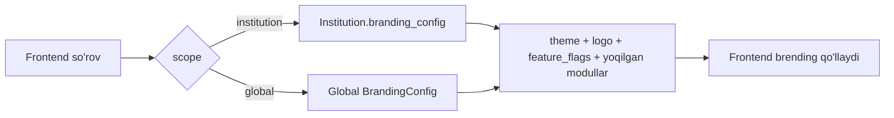

# 💳 Billing / B2B moduli

> Faza 11 (kelajak) · Bog'liq: [[02-Arxitektura/Tizim-Arxitekturasi]] · [[06-Modullar/Accounts]] · [[06-Modullar/Dizayn-Tizimi]] · [[SPEC]]

SPEC §9.2 / §10: TALIM g'oyasini qayta ishlatish — **bir platforma, ko'p mijoz**. Ota-ona obunasi + institutga modul/brending sotish (B2B). Hozircha `billing` app modelsiz skeleton; biznes-logika kelajak fazada.

> [!info] Konfiguratsiya-asoslangan brending
> Har institut/brending uchun rang, logo, yoqilgan modul va feature-flag'lar
> `/api/config/` orqali beriladi — frontend shu yerdan o'z ko'rinishini quradi.

## Modellar (SPEC §10)

| Model | Maydonlar | Maqsad |
|---|---|---|
| `Subscription` | `parent`→FK, `plan`, `status`, `period_end` | Ota-ona obunasi |
| `Institution` | `name`, `branding_config_json` | B2B mijoz (bog'cha/maktab) |
| `ModuleLicense` | `institution`→FK, `module_key`, `signed_key`, `valid_until` | Institutga modul litsenziyasi |
| `BrandingConfig` | `scope[global\|institution]`, `theme_json`, `feature_flags_json` | `/api/config/` manbai |

## /api/config/ oqimi

- `ModuleLicense.signed_key` — institut qaysi modullarga ruxsatli (imzolangan kalit bilan tekshiriladi).
- `feature_flags_json` — modul/feature yoqish-o'chirish (bir kod bazasi, ko'p mijoz).
- Brending tokenlari → [[06-Modullar/Dizayn-Tizimi]] (CSS o'zgaruvchilari runtime'da almashtiriladi).

## Acceptance
- [ ] `Subscription` ota-ona obunasi holatini (plan/status/period_end) saqlaydi.
- [ ] `Institution` + `ModuleLicense` institutga modul litsenziyasini beradi.
- [ ] `/api/config/` scope'ga qarab brending/feature-flag qaytaradi.
- [ ] Frontend `/api/config/` asosida rang/logo/yoqilgan modullarni qo'llaydi.
