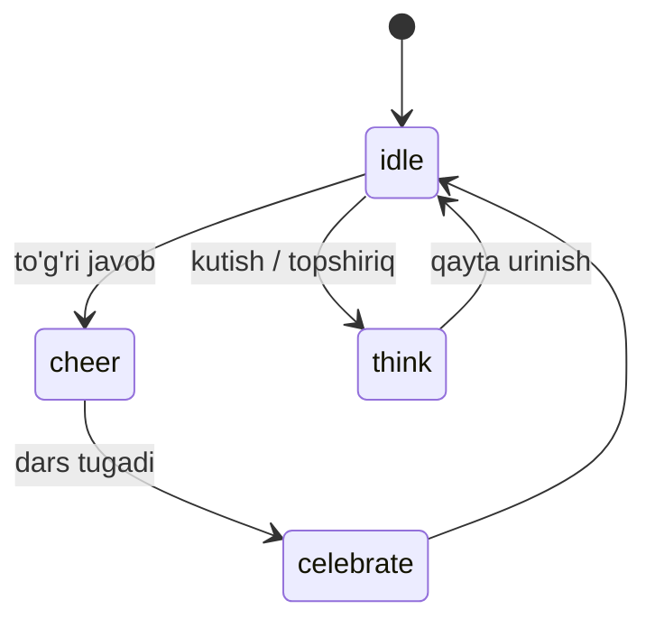

# 🎨 Dizayn tizimi

> Faza 4 · Bog'liq: [[06-Modullar/Oyin-Mexanikalari]] · [[06-Modullar/Geymifikatsiya]] · [[01-Loyiha/Foydalanuvchi-Rollari]] · [[02-Arxitektura/Texnologiyalar-Steki]]

SPEC §7: bola **o'qiy olmaydi** — bosh qoida **audio-birinchi, matnsiz, ulkan teginish nishonlari**. Maskot — Mishka (ayiqcha), auditoriya 3–7 yosh.

## Asosiy UX tamoyillari (SPEC §7.1)
- **Audio-birinchi:** har ekran ovoz bilan; element bosilganda nomi yangraydi (`useAudio` hook, Web Audio API).
- **Soddalik (Toca Boca):** kichiklar uchun ekranda 1–2 tanlov; diqqat jismoniy ta'sirga.
- **Ulkan teginish nishonlari:** min ~80–100px, oraliq keng (kichik barmoqlar).
- **Darhol feedback:** har teginishda tovush + animatsiya.
- **Maskot-boshqaruvi:** navigatsiya Mishka orqali, menyu emas → [[06-Modullar/Geymifikatsiya]].

## Dizayn tokenlari (CSS o'zgaruvchilari — frontend `globals.css`)

| Token | Maqsad |
|---|---|
| `--color-*` | Issiq, yorqin, yuqori kontrast; **rang-ko'r xavfsiz** palitra (rang yagona ma'no tashimaydi — doim + shakl/ikona) |
| `--radius-*` | Yumaloq, do'stona shakllar; o'tkir burchak yo'q |
| `--space-*` | Keng oraliq (ulkan nishonlar uchun) |
| `--shadow-*` | Yumshoq soyalar |
| `--font-*` | Kattalar zonasi uchun aniq, yumaloq shrift (bolalar zonasida matn deyarli yo'q) |

> [!tip] Shablon-default'dan qoching
> `frontend-design` skill tamoyillari: izchil palitra/spacing/typography, o'ziga xos iliq
> bolalarbop identitet. B2B brending tokenlari runtime'da almashinadi → [[06-Modullar/Billing]].

## Mishka maskot holatlari

| Holat | Qachon | Aktiv |
|---|---|---|
| `idle` | bo'sh turish | Lottie/sprite |
| `cheer` | to'g'ri javob | quvonish, qarsak, "ofarin!" |
| `think` | topshiriq/kutish | o'ylanish |
| `celebrate` | dars/yutuq | konfetti, alqash |

## Animatsiya va audio
- **Framer Motion / GSAP** — yumshoq, o'ynoqi, **chalg'itmaydigan** o'tishlar.
- **Web Audio API** — past kechikishli tovush; musiqa/qo'shiq alohida trek → [[06-Modullar/Media]].
- Uzluksiz interaktivlik: har teginish animatsion javob beradi.

## Parent Gate (SPEC §7.4) — bola zonasini "devor bilan o'raydi"
> [!warning] Kattalar tekshiruvi
> Bola zonasi (`/forest`) **matnli ota-ona boshqaruvisiz** (`(child)` route-group, AppBar yo'q).
> Burchakda kichik **🏠** → Parent Gate (matematik misol) → o'tgach kattalar menyusi (profil
> almashtirish / chiqish). Gate o'tmasa — bolaga qaytadi (chiqib keta olmaydi). Gate Faza 1'dan
> qayta ishlatilgan → [[06-Modullar/Accounts]].

> [!success] Bajarildi (Faza 4 — 2026-06-27)
> Dizayn tokenlari (yorqin **rang-ko'r xavfsiz** orange+blue palitra + status=rang+ikona, **Nunito**
> shrift, blob radius, iliq soyalar — Maqola `v()`/`cn()`/barrel mexanizmida). Komponentlar: Mishka
> (4 holat), Confetti, Card, BottomSheet, ulkan Button + **Framer Motion** (reduced-motion). `useAudio`
> kengaytma (element nomi, bitta-ovoz, graceful). **Asset-slot:** Mishka 🐻 placeholder; haqiqiy render
> `MISHKA_MANIFEST`'ga tushadi — kod o'zgarmaydi. **`/forest`** o'rmon xaritasi (REAL curriculum). 6/6 Playwright.

## Ma'lum bo'shliqlar (Known gaps)
- Haqiqiy Pixar-vari 3D Mishka render + jonli UI-audio — **asset ishlab chiqarish** (slot tayyor, kod kutmaydi).
- GSAP ishlatilmadi (Framer Motion yetarli); kerak bo'lsa keyin.

## Acceptance ✅
- [x] Dizayn tokenlari `globals.css`'da CSS o'zgaruvchilari (palitra/radius/spacing/typography).
- [x] Tugmalar min ~80–100px, rang-ko'r xavfsiz palitra (rang + shakl/ikona).
- [x] Audio-birinchi: element bosilganda nomi yangraydi, ovozli ko'rsatma.
- [x] Mishka maskot 4 holat (idle/cheer/think/celebrate) — placeholder asset + real API/slot.
- [x] Framer Motion silliq o'tishlar (reduced-motion hurmat); PWA o'rnatiladigan, to'liq ekran.
- [x] Parent Gate bola zonasidan chiqishni himoyalaydi (devor bilan o'ralgan).
