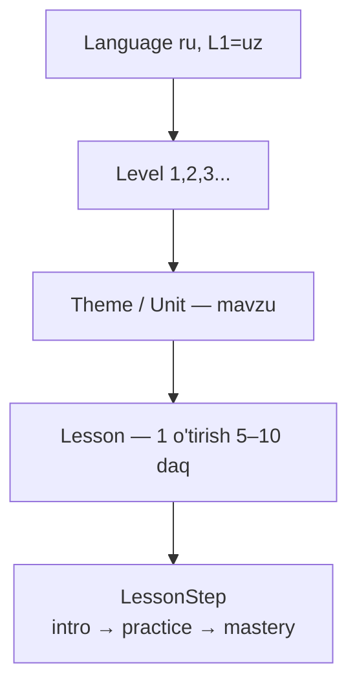

# 📚 Kontent moduli (kurikulum)

> Faza 2 · Bog'liq: [[01-Loyiha/Pedagogik-Asos]] · [[06-Modullar/Media]] · [[06-Modullar/SRS-Learning]] · [[06-Modullar/Oyin-Mexanikalari]]

SPEC §3 bo'yicha kurikulum modeli. **Ikki parallel trek:**
- **Trek A — Alifbo/Fonetika:** 33 kirill harfi, oson→qiyin 4 guruh (rus fonetik: 1 harf ≈ 1 tovush).
- **Trek B — So'z boyligi:** tematik birliklar (Oila, Hayvonlar, Ranglar...). Audio-birinchi, rasm-asosli, TPR.

> [!tip] O'zbek bolasiga bonus
> Kognat so'zlar (`stol`, `divan`, `mashina`, `park`, `avtobus`) `is_cognate_uz=true` bilan
> belgilanadi va **birinchi** o'rgatiladi — tez g'alaba, kuchli motivatsiya.

## Ierarxiya (SPEC §3)

## Modellar (SPEC §10)

| Model | Asosiy maydonlar |
|---|---|
| `Language` | `code`, `name` |
| `Level` | `language`, `order`, `title_uz/ru` |
| `Theme/Unit` | `level`, `order`, `key`, `title_uz/ru`, `icon` |
| `Lesson` | `theme`, `order`, `title_uz/ru`, `min_age_band` |
| `LessonStep` | `lesson`, `order`, `kind[intro\|practice\|mastery]`, `config_json` |
| `Letter` | `char`, `sound_ipa`, `audio`→Media, `mnemonic_image`→Media, `group_no`, `order` |
| `Word` | `lemma`, `translit`, `l1_translation_json`, `image`/`audio_native`→Media, `theme`, `difficulty`, `part_of_speech`, `gender`, `plural_form`, `freq_rank`, `is_cognate_uz` |
| `Phrase` / `Song` / `Story`+`StoryNode` | TPRS/qo'shiq kontenti, `word_refs[]` |
| `GameType` | mexanika katalogi → [[06-Modullar/Oyin-Mexanikalari]] |

## Dars mikro-tuzilishi (har darsda)
1. **Intro** — yangi so'z/harf: rasm + L1 audio + ishora (Mishka tanishtiradi, i+1).
2. **Practice** — 2–4 mini-o'yin; bu yerda SRS dvigateli ishlaydi → [[06-Modullar/SRS-Learning]].
3. **Mastery** — adaptiv mini-tekshiruv; natija SRS holatini yangilaydi + mukofot.

## Boshqaruv
- **Django Admin** — inline'lar bilan (Lesson ichida LessonStep, Theme ichida Lesson), Media yuklash maydonlari. MVP uchun yetarli.
- **`seed_content`** management command (**idempotent** — `get_or_create`): ru+uz, Level 1, 1-harf guruhi (А,О,К,М,Т,С,Н,И), 2 mavzu (Hayvonlar uy, Ranglar), har mavzuda intro→practice→mastery dars, GameType katalogi (§5 — 11 mexanika). `make seed`.

> [!success] Bajarildi (Faza 2 — 2026-06-27)
> `media.0001` + `content.0001` **additiv** migratsiya (accounts buzilmadi). Word'da `stress_index`
> (urg'u: зáмок≠замóк) + `l1_translation_json` ({"uz":...}, B2B ko'p-L1). GameType — 11 mexanika,
> `schema_json` bilan. LessonStep `config_json` — data-driven yelim (so'z ID + GameType kalit).
> Seed: 12 so'z, 8 harf, 11 GameType, 2 dars, 6 qadam. 21 pytest yashil. Media FK'lar **nullable**
> (real jonli ovoz/rasm — kontent-ishlab chiqarish, Faza 3 media pipeline). Admin login + dizayn
> (collectstatic) + CSRF (`CSRF_TRUSTED_ORIGINS`) tuzatildi.

## Acceptance ✅
- [x] Barcha kurikulum modellari additiv migratsiya bo'ladi (accounts saqlanadi).
- [x] Django Admin'da inline'lar bilan kontent kiritiladi/tahrirlanadi.
- [x] `seed_content` demo darslarni (harf guruhi + 2 mavzu) yaratadi — **idempotent**.
- [x] GameType katalogi 11 mexanika bilan to'la (`schema_json`).
- [x] `is_cognate_uz`, `stress_index`, `l1_translation_json` ishlaydi.

> [!question] Ochiq savol — `config_json` / `schema_json` strukturasi
> Faza 5 (o'yin dvigateli) kodga tegmasdan `config_json`+`schema_json`dan renderlay oladimi?
> Faza 6 SRS dinamik so'zni statik `config_json`ga qanday qo'shadi? → Faza 5 boshida ko'rib chiqiladi.
