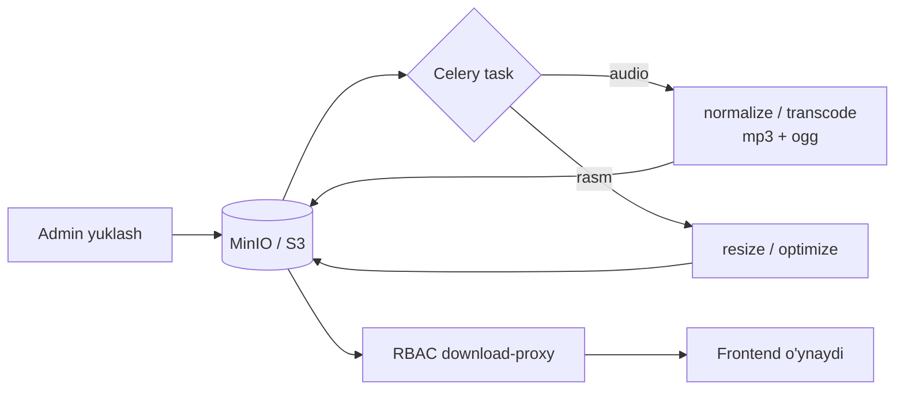

# 🎨 Media moduli

> Faza 3 · Bog'liq: [[06-Modullar/Kontent]] · [[02-Arxitektura/Tizim-Arxitekturasi]] · [[02-Arxitektura/Xavfsizlik]] · [[05-DevOps/Docker-Setup]]

SPEC §9.2 / §7.3: barcha audio/rasm/lottie aktivlari S3-mos object storage'da (dev=MinIO, prod=S3+CDN). Audio — **ona tilida so'zlovchi** (native speaker), past kechikishli (Web Audio API).

> [!info] Faza 2'da yaratilgan qism
> `Media` modeli + admin preview + **MinIO yuklash** Faza 2'da qo'shildi (content FK'lari uchun) va
> end-to-end tasdiqlandi (fayl bucket'ga saqlanadi/o'qiladi). **Faza 3'da to'liq pipeline:** Celery
> transcode/optimize, RBAC download-proxy, va brauzer uchun **public URL** (`minio:9000` ichki →
> `localhost:9000`/CDN; `MINIO_PUBLIC_DOMAIN` ni settings'ga ulash).

## Model (SPEC §10)

| Model | Maydonlar |
|---|---|
| `Media` | `kind[audio\|image\|lottie]`, `storage_key`, `duration_ms`, `meta_json` |

Kontent modellari Media'ga FK bilan ulanadi: `Word.audio_native`, `Word.image`, `Letter.audio`, `Letter.mnemonic_image`, `Song.audio` → [[06-Modullar/Kontent]].

## Pipeline

- **Celery worker** (SPEC §9.2): audio normalize/transcode (mp3/ogg), rasm resize/optimize → [[06-Modullar/Oyin-Mexanikalari]] uchun tayyor aktivlar.
- TTS — kontent yaratish bosqichida vaqtinchalik o'rinbosar; ishlab chiqarishda jonli ovoz.

## RBAC download-proxy
> [!info] Media bevosita ochiq emas
> `/media/` Nginx orqali RBAC-proxy'ga yo'naltiriladi: media faqat ruxsatli
> bola/ota-ona uchun beriladi → [[02-Arxitektura/Xavfsizlik]]. CDN keshlash + signed URL.

## Kontent API bilan bog'liqlik
- `GET /api/lesson/{id}/` javoblari to'liq media URL'lar bilan qaytadi — frontend qo'shimcha so'rovsiz o'ynay olsin.
- Kontent kamdan-kam o'zgaradi → Redis kesh + ETag.

## Acceptance
- [ ] Media MinIO/S3'ga yuklanadi; `Media` `storage_key`/`duration`/`meta` saqlaydi.
- [ ] Celery audio normalize/transcode (mp3/ogg) va rasm optimize ishlaydi.
- [ ] `/media/` RBAC-proxy ruxsatsiz kirishni bloklaydi.
- [ ] Kontent API media URL'larini to'liq qaytaradi (frontend qo'shimcha so'rovsiz o'ynaydi).
