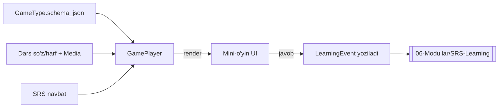

# 🎮 O'yin mexanikalari

> Faza 5/7/9 · Bog'liq: [[06-Modullar/SRS-Learning]] · [[06-Modullar/Kontent]] · [[06-Modullar/Dizayn-Tizimi]] · [[01-Loyiha/Pedagogik-Asos]]

SPEC §5: har mexanika **ko'nikma + retrieval** turiga bog'langan va `GameType` katalogida saqlanadi. Dars o'z so'zlarini shu mexanikalarga "quyadi" — har biri **data-driven** (kontentdan mustaqil).

> [!info] Faza 4'da tayyorlangan poydevor (o'yin LOGIKASI Faza 5)
> - `GameType` katalogi (11 mexanika + `schema_json`) — Faza 2; `config_json.games` (per-o'yin params) — Faza 2.5.
> - `/lesson/{id}` to'liq resolve qilingan kontent (so'z+media URL+games+schema+confusable) — Faza 3.
> - **Feedback komponentlari tayyor (Faza 4):** `Confetti` (to'g'ri javob), `Mishka` `cheer`/`celebrate` holatlari, `useAudio`.
> - **Faza 5:** `GamePlayer` (config→render) + dars oqimi (intro→practice→mastery) + 3 mexanika + distractor tanlash (`exclude_confusable`). Bola zonasi qobig'i (`/forest`) tayyor → [[06-Modullar/Dizayn-Tizimi]].

## 11 mexanika (SPEC §5)

| # | O'yin (uz / ru) | Ko'nikma | Retrieval turi | Yosh | Faza |
|---|---|---|---|---|---|
| 1 | Eshit va bos / «Слушай и нажми» | So'z↔rasm (reseptiv) | Tanib olish | 3+ | 5 |
| 2 | Juftla / «Найди пару» | Rasm↔audio/rasm | Xotira + tanib olish | 3+ | 5 |
| 3 | Topib ber / «Покажи …» (TPR) | Sahnada topish | Kontekstli tanib olish | 3+ | 5 |
| 4 | Harf ovi / «Где буква?» | Harfni tanish | Harf tanib olish | 5+ | 7 |
| 5 | Harf chiz / «Обведи букву» | Harf yozish (motor) | Ishlab chiqarish (motor) | 5+ | 7 |
| 6 | Qaysi tovush? / «Какой звук?» | Tovush→harf | Fonematik | 5+ | 7 |
| 7 | So'z qur / «Собери слово» | Bo'g'in/harfdan so'z | Ishlab chiqarish | 6+ | 7 |
| 8 | Sehrli ertak / «Сказка» (TPRS) | So'z kontekstda | Kontekstli, tanlovli | 5+ | 9 |
| 9 | Qo'shiq / «Песенка» | So'z+musiqa+harakat | Ko'p sezgili | 3+ | 9 |
| 10 | Aytib ber / «Скажи!» (ASR) | So'zni aytish | Ekspressiv (ovozli) | 5+ | 11 |
| 11 | Takrorlash o'yini / «Повторюшка» | Aralash, muddati kelgan | Aralash retrieval | 4+ | 6 |

## Data-driven GamePlayer

Yangi so'z qo'shilsa — hamma o'yin avtomatik ishlaydi (mexanika kontentga bog'lanmagan). Umumiy `GamePlayer` `GameType.schema_json` + kontent + SRS navbatini birlashtirib render qiladi.

## Mexanika = REGISTRY plugin (Faza 5 qarori — [[99-Resurslar/Qaror-Jurnali#ADR-012 — O'yin dvigateli: registry plugin + frontend distraktor|ADR-012]])
> [!important] Markaziy `if/elif` YO'Q
> Har mexanika alohida komponent va o'zini `registerMechanic(key, Component)` orqali ro'yxatga oladi
> (`frontend/lib/games/registry.ts`). `GamePlayer` faqat **kontrakt** beradi:
> `MechanicProps { items, pool, spec, ageBand, onResult, onDone }`. Mexanika o'zini renderlaydi,
> javobni qabul qiladi, `onResult(correct, latencyMs, hintUsed)` qaytaradi.
> **Yangi mexanika = yangi komponent + `mechanics/index.ts`ga 1 qator.** GamePlayer o'zgarmaydi →
> Faza 7 (harf_ovi, harf_chiz, qaysi_tovush, so'z_qur) va Faza 9 (sehrli_ertak, qo'shiq) shunchaki plugin.

## Distraktor tanlash (§4.4) — FRONTEND (Faza 5'da paydo bo'ldi)
- `frontend/lib/games/distractors.ts`: `buildOptions(target, pool, optionCount, excludeConfusable)`.
- **Manba** = mavzu/dars so'zlari (joriy to'g'ridan tashqari). `/lesson` javobi `confusable_ids` + so'zlarni yetkazadi → backend qo'shimcha so'rovsiz.
- `exclude_confusable: true` → `confusable_ids` distraktor bo'la **olmaydi** (кошка↔коза yonma-yon chiqmaydi — §4.4 interferensiya).
- `option_count`: schema `[2,4]` diapazonidan **age_band** bo'yicha (3-4→2, 5-6→3, 6-7→4) — config'da QOTIRILMAGAN. Graceful (kichik mavzu → kamroq, lekin ≥2).

## Faza 6 kontrakti tayyor (ADR-010) — GamePlayer o'zgarmasin
- `lib/games/session.buildSessionQueue(newItems, dueItems=[])` — hozir `due=[]`; Faza 6 SRS due so'zlarni `interleave` qiladi (confusable yonma-yon emas).
- `lib/learningEvents.recordResult(...)` — hozir `localStorage` outbox; Faza 6 → `POST /api/v1/learning/event/`. Interfeys o'zgarmaydi.

## Feedback qoidalari (jazo YO'Q)
> [!success] To'g'ri javob
> Mishka quvonadi, konfetti, yoqimli tovush — darhol, bo'rttirilgan ijobiy feedback (Duolingo uslubi).

> [!question] Xato javob
> Jazo yo'q. Mishka "qayta urinaylik" deydi → maslahat (rasm yiriklashadi / audio qayta yangraydi) → qayta imkon.

- **Kichiklar (3–4):** ekranda 2 ta tanlov, taymer yo'q.
- Har javob → `LearningEvent` → SRS yangilanadi → [[06-Modullar/SRS-Learning]].

## Acceptance
- [ ] `GamePlayer` `GameType.schema_json` asosida data-driven render qiladi.
- [ ] 3 mexanika (Eshit va bos, Juftla, Topib ber) Faza 5'da to'liq o'ynaladi.
- [ ] Dars oqimi: intro → practice → mastery → natija ekrani.
- [ ] To'g'ri/xato feedback (jazosiz) ishlaydi; har javob LearningEvent'ga yoziladi.
- [ ] Yangi so'z qo'shilganda hech bir mexanikaga qo'l tegmaydi (avtomatik).
